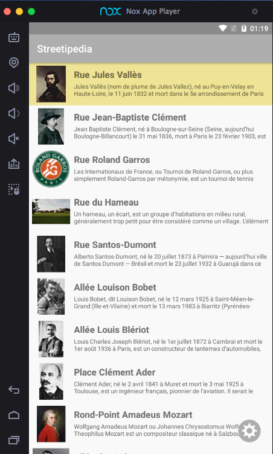
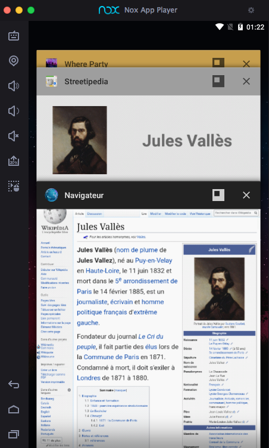
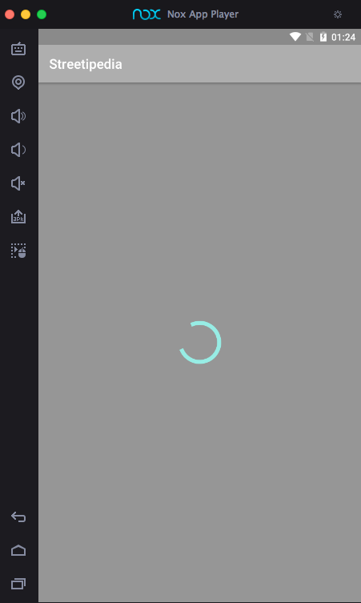
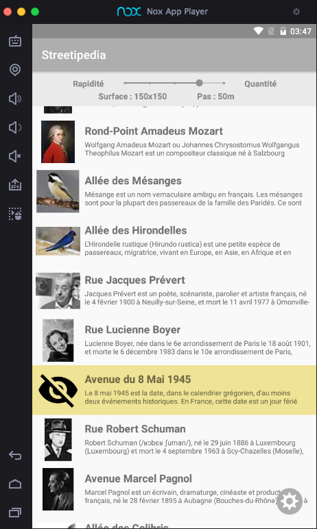

# Streetipedia

## Présentation :

Cette **application Android** a pour vocation de trouver des **informations** sur le **sujet** d'un **nom de rue** via [l'API Wikipédia](https://www.mediawiki.org/wiki/API:Main_page).

Elle a été développée avec l'utilisation du [pattern MVC](https://en.wikipedia.org/wiki/Model–view–controller) et en respectant le [modèle GitFlow](https://danielkummer.github.io/git-flow-cheatsheet/index.fr_FR.html) sur Android Studio.

## Idée :

**L'idée** de cette petite application est de pouvoir **à tout moment** sortir son téléphone et pouvoir **se renseigner** (Qui ? Quoi ? Où ?) sur **le nom de la rue** où **l'on se situe** ou une que **l'on vient de croiser**.

## Prérequis :

- Installation **d'Android Studio**
- **Se renseigner** sur les différentes **API** utilisé ([Wikipédia](https://www.mediawiki.org/wiki/API:Main_page) et [Bing Maps](https://docs.microsoft.com/en-us/bingmaps/rest-services/locations/find-a-location-by-address))
- **Se procurer** une **clé** pour **l'API Bing Maps**

## Notation :
### Minimale :
- **Ecran** avec une **liste d'éléments**
- **Ecran** avec le **détail d'un élément**
- Appel **WebService** à une **API Rest**
- **Stokage** de données en **cache**

### Les plus :
- **Architecture** :
	- Singleton
	- Design Patterns
	- **MVC**
	- Principe SOLID
- **Gitflow**
- Design

### Autres fonctionnalités :
- **Création** d'un mini **algorithme** pour récupérer les **rues aux alentours**
- Récupération des **données** de **géolocalisation** et de **connectivité**
- Plusieurs **appels WebService** avec **2 API** différentes
- **Ouverture** d'une **page web** via un bouton
- Implémentation du **swipe** sur la **recycler view** pour **rafraichir les données**
- Menu de **réglage** pour **gérer l'algorithme**
- **Animation** de ce menu
- Gestion de **tâche asynchrone** pour l'affichage d'un **overlay de chargement**
- **Affichage d'images** via la librarie **[Picasso](https://square.github.io/picasso/)**
- **Création** d'une **icône personalisé** via **Gimp**

## Fonctionnalités :

#### Ecran d'affichage de la liste des rues avoisinantes

**Affichage** de la **liste des rues** retourné par l'algorithme

La **rue actuelle** est affichée avec un **fond couleur or** (voir la section **Problèmes**) 

#### Menu réglage

Menu réglage obtenu en **appuyant** sur le **bouton en bas à droite**

Cela permet de **changer** la **façon de calculer la liste** de rues avec un **temps d'exécution** qui **évolue**
 
Il y a **2 facteurs** :

- **La surface :** C'est à dire la **zone carrée** qui va être balayée (en mètres carrés)
- **Le pas :** C'est à dire **l'intervalle** qui sépare 2 requêtes (en mètres)

Lors d'un **changement** si le nombre de rue devrait théoriquement **évoluer** l'algorithme **recalcule la liste**

#### Ecran d'affichage d'un élément sélectionné

Affichage d'une **nouvelle vue** avec le **nom** et la **description** de la page, une **photo** si disponible et un **bouton** permettant d'accéder directement à **Wikipédia sur le browser**

#### Ouverture d'une page Wikipédia via le bouton dédié

Illustration de **l'ouverture d'une page web** via l'application :

#### Overlay en tâche asynchrone pour attendre le chargement

Illustration de **l'écran d'attente** pendant le **chargement** de toutes les données.

## Problèmes :

Liste **des problèmes persistants** (malgré de nombreux essais de résolution) :

- Affichage d'une **ombre** sous le **bouton réglage**
- Pour **souligner** la rue où se **situe l'utilisateur** la couleur de fond est modifié. Le **problème** est que cette **couleur de fond** se retrouve dans **d'autres éléments** de la recycler view **lorsqu'un scroll est effectué** sans aucune raison

